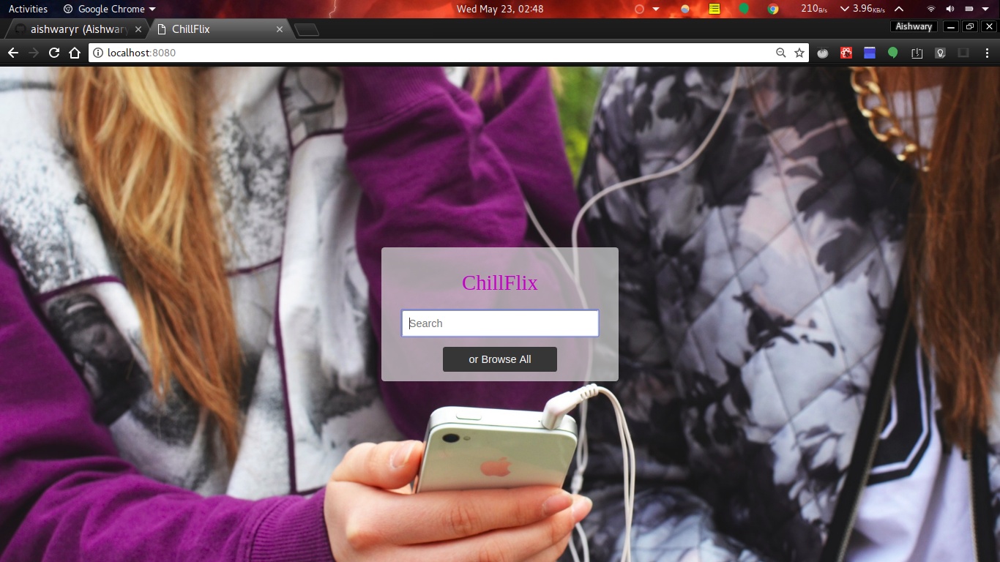

# React Basic Netflix App using Redux and Flow

## Need to install Yarn, ESLint, Flow, Prettier and related packages globally

## Install all the dependencies of project: _yarn_

## To start dev server: _yarn dev_

## Run _yarn api_ in seperate terminal to run Ratings Api

Screenshots

Landing Page

Search Page

Details Page

